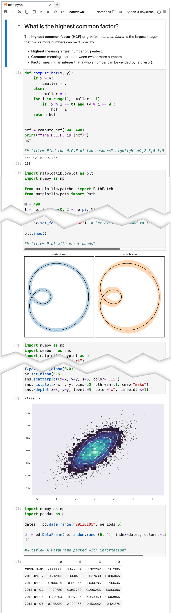
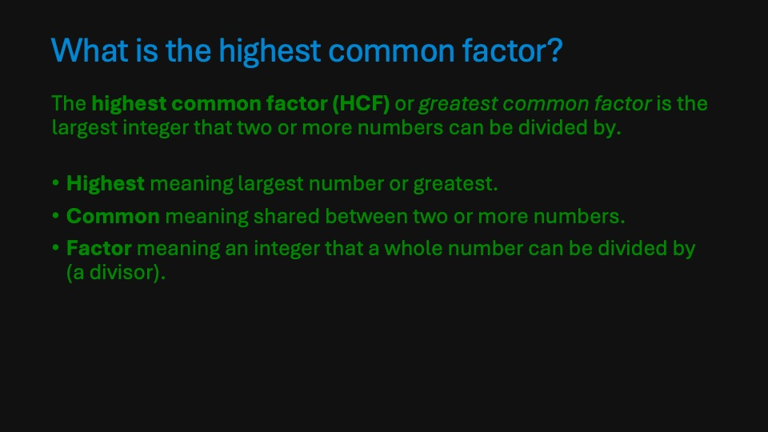
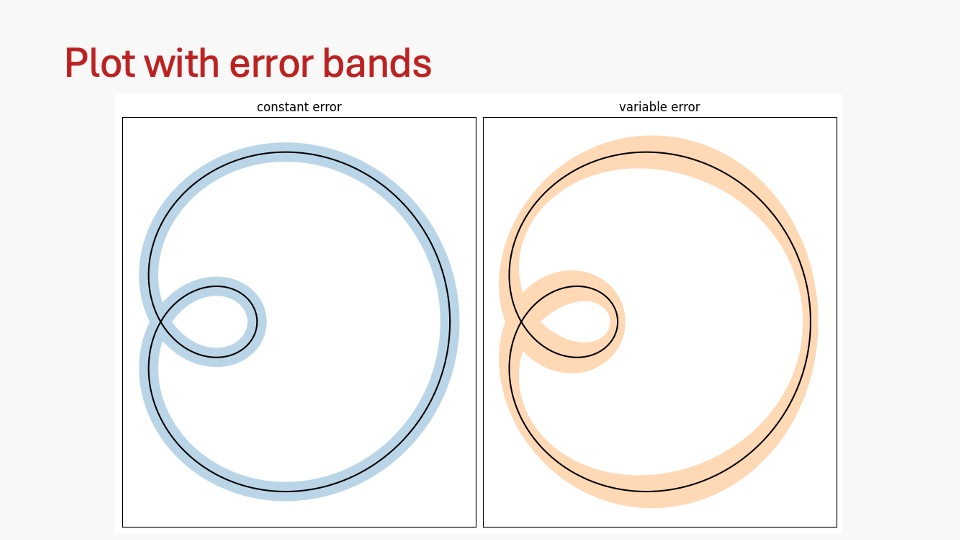
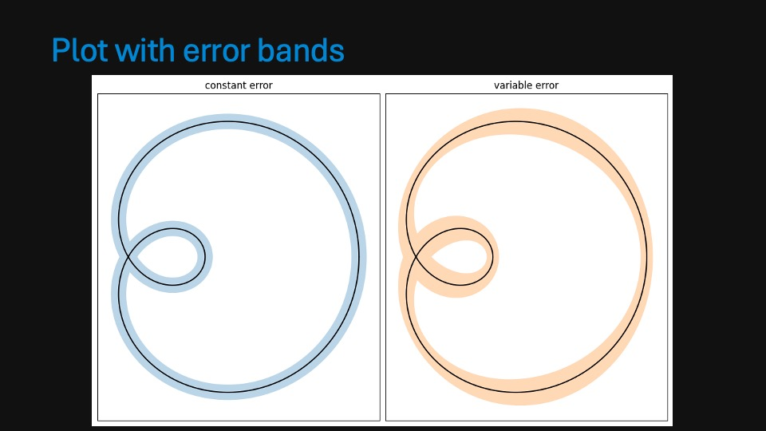
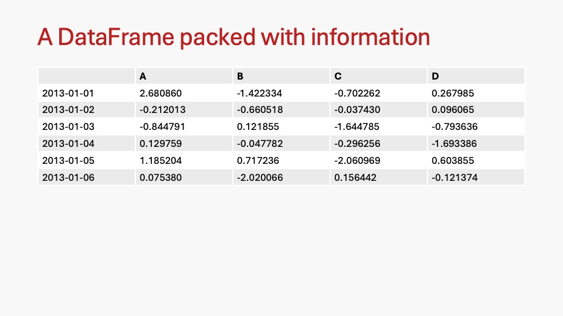
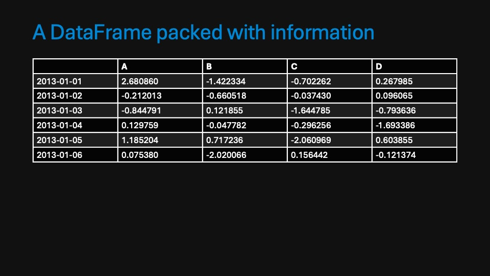

PresentPy
=========

 > Create slides from Jupyter Notebooks

_PresentPy_ allows you to take your Jupyter Notebooks and turn them into slides (compatible with PowerPoint, Keynote, LibreOffice...) that then can be integrated into your presentation decks.

## Installation

I strongly recommend using `pipx` to install _PresentPy_:

```bash
pipx install presentpy
```

Otherwise, you can install it using `pip` or your favorite package manager – the package is called `presentpy`.

## Usage

To turn a notebook into slides, simply run:

```bash
Usage: presentpy [OPTIONS] NOTEBOOK

  A CLI tool to convert Jupyter Notebooks to slides.

Options:
  --output PATH  Directory or file path where the output ODP file will be
                 saved. Defaults to the current directory.
  --theme TEXT   Pygments style to be applied to the presentation.Defaults to
                 'default'. See https://pygments.org/docs/styles/ for
                 available styles.
  --outputs      Include code cell outputs in the presentation.
  --help         Show this message and exit.
```

<!-- 
It also works with Python scripts:

```bash
presentpy [OPTIONS] py SCRIPT_PATH
```
-->

## Code configuration

You can configure the code cells to be displayed in the slides by adding a comment on the last line of the cell. The comment should start with `#%` and then you can add the following options:

 - `title`: The title of the slide
 - `highlights`: A comma separated list of lines to highlight, each highlight could be a number or a range of lines separated by a dash, e.g. `1,3-6,6-7`

## Example

Consider the notebook shown below, when converted to slides using the `default` theme, it will look like the first image in the table below. When converted using the `fruity` theme, it will look like the second image.

<table>
	<tbody>
        <tr>
			<th colspan="2">Original notebook [<a href="tests/files/test.ipynb" target="_blank">view .ipynb</a>]</th>
        </tr>
        <tr>
			<td colspan="2">
                
            </td>
        </tr>
		<tr>
			<th>Default theme 
                [<a href="https://drive.google.com/file/d/1HuYzFU8rTMa21dC0r7hD9gFByJJ3Cd4f/view?usp=sharing" target="_blank">as PDF</a>]
                [<a href="https://docs.google.com/presentation/d/1ZuRIwh6Eq11AAp6JtsMZw9yhbDB2yZAzAFEDrw3bvF4/edit?usp=sharing">as Google Slides</a>]
            </th>
			<th>Fruity theme 
                [<a href="https://drive.google.com/file/d/1a5FwVKyBWUS7iGJZoFlO_vnd_czbMZBe/view?usp=drive_link" target="_blank">as PDF</a>]
                [<a href="https://docs.google.com/presentation/d/1ObZPZx9lEE_UuqjXcfrRuwPq2dmQTahiO7yq1Zqjwc8/edit?usp=sharing">as Google Slides</a>]
            </th>
		</tr>
		<tr>
            <td>
                
            </td>
			<td>
                
            </td>
		</tr>
		<tr>
            <td>
                
            </td>
			<td>
                
            </td>
		</tr>
		<tr>
            <td>
                
            </td>
			<td>
                
            </td>
		</tr>
		<tr>
            <td colspan="2">
                Slides omitted as the only change is the highlighting of the code.
            </td>
		</tr>
		<tr>
            <td>
                
            </td>
			<td>
                
            </td>
		</tr>
		<tr>
            <td>
                
            </td>
			<td>
                
            </td>
		</tr>
		<tr>
            <td>
                
            </td>
			<td>
                
            </td>
		</tr>
	</tbody>
</table>

You can then use these slides in your presentation deck.
